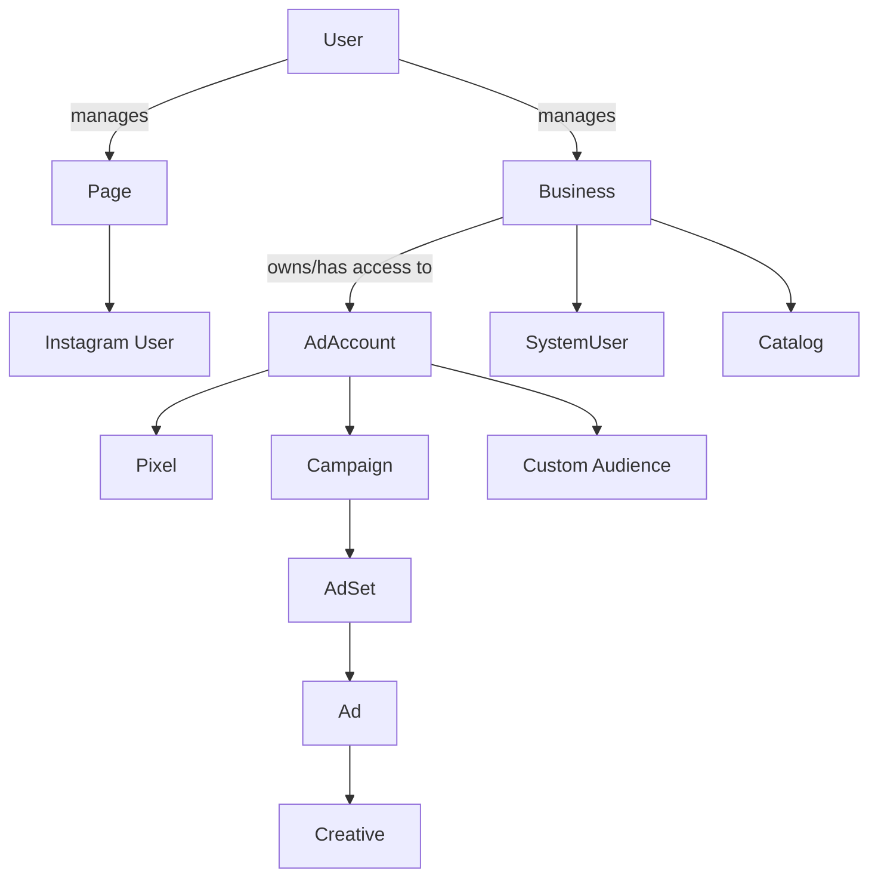

```
/**
 * Feature: Meta Graph API Explorer Map (Lean Pyramid)
 * Purpose: Minimal, high‑level requests that return many related objects via fields expansion; pasteable into Graph API Explorer.
 * References:
 *  - Meta Graph API (Overview): https://developers.facebook.com/docs/graph-api/
 *  - Access Tokens: https://developers.facebook.com/docs/graph-api/overview/access-tokens/
 *  - Permissions Reference: https://developers.facebook.com/docs/permissions/reference
 *  - Business System Users: https://developers.facebook.com/docs/marketing-api/systemuser/
 *  - Pages & IG Graph: https://developers.facebook.com/docs/pages/ and https://developers.facebook.com/docs/instagram-api/
 *  - Marketing API (Ad Accounts & Campaigns): https://developers.facebook.com/docs/marketing-apis/
 */
```

### Meta Graph API Explorer – Lean “Pyramid” Map

Goal: minimize requests using fields expansion so each call returns a broader slice of the graph. All Paths omit `/vXX.X`; select the version in the Explorer UI.

---

### Quick start

1) In Graph API Explorer choose a token:
- User Token → Generate and add scopes below
- System User Token → Paste your Business System User token

2) Paste the 3 calls below (plus optional insights). Use small limits to keep payloads fast.

> Dialogs like `ads_payment` require numeric `account_id` (no `act_` prefix). Graph API endpoints use `act_{ad-account-id}`.

---

### Minimal scopes (read‑only verification)

- `business_management`, `pages_show_list`, `pages_read_engagement`, `pages_manage_metadata`, `instagram_basic`, `ads_read`.

### Token quick guide (for this map)
- Long‑lived User Access Token: best default for Levels 1–3 reads.
- User App Token: preferred for role/permission edges (business/ad account users).
- Page Access Token: required for page/IG actions (not used in the calls below, but you’ll get it from `/me/accounts`).
- Our app fields: `long_lived_user_token`, `user_app_token`, `selected_page_access_token`.

---

### Level 1 – Top (Identity pivot)

Paste in Path:

`/me?fields=id,name,businesses.limit(5){id,name,owned_pages.limit(5){id,name,instagram_business_account},owned_ad_accounts.limit(5){id,account_id,name,currency,account_status}}`

Token to use: Long‑lived User Access Token (or a fresh User App Token). Scopes: `business_management`, `pages_show_list`, `ads_read`.

What returns (one response):
- Your user info
- Up to 5 businesses you manage
- For each business: up to 5 owned pages (+ IG link), and up to 5 owned ad accounts (basic info)

---

### Level 2 – Business pivot (deeper drill)

Replace `{business-id}` with one from Level 1:

`/{business-id}?fields=id,name,owned_pages.limit(10){id,name,instagram_business_account},owned_ad_accounts.limit(10){id,account_id,name,currency,account_status,campaigns.limit(10){id,name,objective,status,adsets.limit(5){id,name,status},ads.limit(5){id,name,status}}},system_users.limit(5){id,name,role},owned_product_catalogs.limit(5){id,name,vertical}`

Token to use:
- For basic business/page/ad account reads: Long‑lived User Access Token.
- For user/role edges (`users`, `people`, `assigned_users`, `business_users`): User App Token preferred for accurate role checks.

What returns:
- Pages (+ IG link), Ad Accounts
- For each Ad Account: shallow samples of Campaigns, Ad Sets, Ads
- System users and product catalogs for quick verification

---

### Level 3 – Ad Account pivot (structure + assets)

Replace `{ad-account-id}` with the numeric ID (keep `act_` in the Path):

`/act_{ad-account-id}?fields=id,account_id,name,currency,timezone_id,campaigns.limit(10){id,name,objective,status,adsets.limit(5){id,name,status},ads.limit(5){id,name,status}},adspixels.limit(5){id,name},customaudiences.limit(5){id,name,approximate_count,delivery_status}`

Token to use:
- Structure/details (fields above): Long‑lived User Access Token.
- If exploring `/users?fields=id,tasks` for roles: User App Token preferred.
- Managing ads requires `ads_management` (not shown here; these are reads).

What returns:
- Ad Account basics
- Sample Campaigns, Ad Sets, Ads
- Pixels and Custom Audiences

---

### Optional Level 4 – Insights (kept separate for performance)

- Account last 7 days:
`/act_{ad-account-id}/insights?date_preset=last_7d&fields=impressions,spend,clicks,ctr&limit=50`

- Per‑campaign last 7 days:
`/{campaign-id}/insights?date_preset=last_7d&fields=impressions,spend,clicks,ctr`

Token to use: Long‑lived User Access Token (or User App Token) with `ads_read`.

---

### Relationship diagram (for context)



---

### Troubleshooting (fast)

- `(#100) Unsupported get request` (code 100, subcode 33): wrong path or asset not visible to token. Check ID spelling, version selector, and required scopes/asset assignment.
- `OAuthException` with `permissions error`: missing scope; re‑generate token with the scopes listed above.
- Empty lists for business or ad accounts: user/system not assigned in Business Manager, or asset not connected to that Business.
- Ads dialogs: pass numeric `account_id` (no `act_` prefix) or the dialog page 404s.

---

### References
- Graph API overview: https://developers.facebook.com/docs/graph-api/
- Tokens: https://developers.facebook.com/docs/graph-api/overview/access-tokens/
- Permissions: https://developers.facebook.com/docs/permissions/reference
- Business System Users: https://developers.facebook.com/docs/marketing-api/systemuser/
- Pages API: https://developers.facebook.com/docs/pages/
- Instagram Graph: https://developers.facebook.com/docs/instagram-api/
- Marketing API (Ad Account/Campaign): https://developers.facebook.com/docs/marketing-apis/


